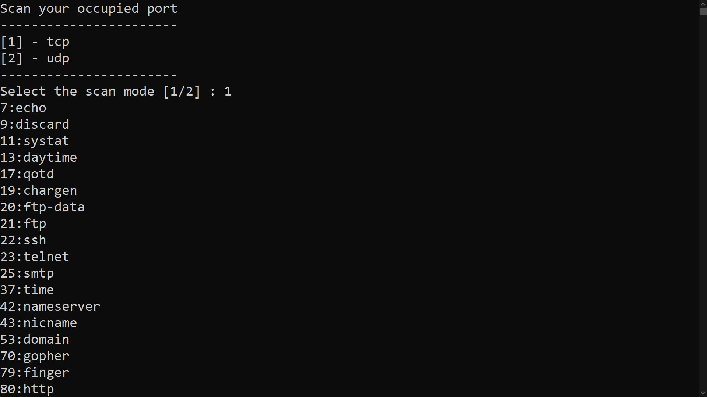

# occupied_port
**Scan the occupied ports on the system and print them along with the name.**
- [Install](#install)
- [Use](#use)


# install 
```
bash <(curl -Ls https://raw.githubusercontent.com/PhoenixPars/occupied_port/main/install.sh)
```
# use
To use it, you need to enter the script folder and run the following command : 
```python scan.sh```
